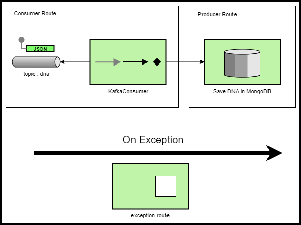

# mutant-detector-worker

[](https://app.travis-ci.com/leosthewar/mutant-detector-worker)
[](https://coveralls.io/github/leosthewar/mutant-detector-worker?branch=main)

Microservicio Worker que se  suscribe al   de apache Kafka  para obtener el mensaje con el resultado de la validación de la secuencia de ADN y almacenarlo en la base datos MongoDB. 

# Diagrama EIP



# Descripción técnica
El microservicio esta desarrollado con Spring Boot y Apache Camel, por lo cual se utilizan lineamientos del patron de integración.

El servicio se suscribe como consumidor del topic: dna de Kafka. De esta manera cada vez que se genera un evento con mensaje de la validación de una secuencia de ADN, este worker se encarga de recibir el mensaje y enviarlo a la base de datos MongoDB de manera asíncrona, mejorando asi los tiempos de respuesta del servicio /mutants/ y el comportamiento  del mismo ante fluctuaciones agresivas de trafico.
# Instrucciones de ejecución
## Ejecución local
### Prerrequisitos

- JDK 11
- Maven 3

Para ejecutar el servicio de manera local ejecute el comando

```shell
mvn spring-boot:run
```
## Despliegue en Openshift

### Prerrequisitos
- Cluster de Openshift
- Credenciales de acceso al cluster
- CLI Openshift
- Base de  datos Mongo
- Configuración de Opensfhit para acceder a servicios externos al cluster.

Para desplegar el servicio en Openshift, se usa la CLI de Openshift ejecutando los siguientes comandos

- Iniciar sesión

```shell
oc login <host>
```

- Seleccionar el Project ( en este caso en el sandbox crea un project de manera automática y no se permite crear mas , por lo cual este paso se puede omitir)

```shell
oc project <project>
```
- Crear Configmap con los propiedades del servicio
```shell
oc create configmap mutant-detector-worker-config --from-file=src/main/resources/ --dry-run=client -o yaml | oc apply --force -f -
```

- Compilar y desplegar

```shell
mvn -Popenshift clean package oc:build oc:resource oc:apply -DskipTests
```
Se crearan, entre otros, los siguientes recursos de Openshift:

- ImageStream "mutant-detector-worker"

- BuildConfig "mutant-detector-worker-s2i"

- DeploymentConfig "mutant-detector-worker"

- Service "mutant-detector-worker"
  
### Consideraciones

Para las ejecuciones locales y en openshift se deben tener configurado:
-  Properties de conexión y credenciales del servidor de apache kafka
-  Properties de conexión y credenciales del servidor de mongodb

Para la ejecución en Openshift 
- Configuración de Openshift para  acceder a servicios externos

## Documentación general de la prueba
https://github.com/leosthewar/mutant-detector-meli-challenge